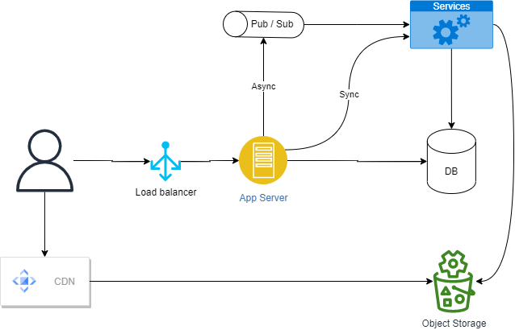

# Twitter / X design architecture
## Assumption ##
- Functional requirement covered:
  - Create Tweet
  - View Feed
- Technical Assumption:
  - 200 mio active user
  - 20 bio tweet read / day
  - Tweet contains Text, Images or Videos

## High Level Design ##

  

- Application Server
  
  Main backend for frontend services eg. create tweet, push feed, follow somewone, etc.
  Instance can be horizontally scaled to adjust with its load So the services should be stateless.

- Load Balancer

  To handle bottleneck, improve performance, part of reliability and availability also to support scaling of the backend.

- DB

  Relational database or Graph DB used to store core data since i assume the type of data may have lots of relation. eg. tweet to user, follower with followee, etc. NoSql db may be used for analytical purpose.

- Cache

  Considering massive amount of tweet reads, it is better reading cache before we read our database
  
- Object Storage

  To keep images and videos we can use eg Amazon S3, Google CLoud Storage, etc.

- CDN

  Since media is static in nature, it may be better to distribute them over the CDN network tied with our Object Storage. The app server will respond to the user with url of the media that they need.

- Pub/Sub

  Integration layer that handle async transaction. to improve fault tolerance, adding scalability and flexibility.

- Services

  Supporting services that handle specific function that supports  eg. Write tweet to DB, Sync cache, 
